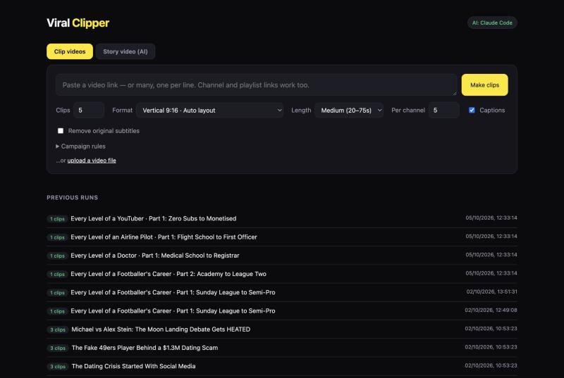

# Viral Clipper

[](https://github.com/ibiraza1077-pixel/viral-clipper/actions/workflows/ci.yml)

Paste a video link and get ready-to-post short clips of the moments most likely to go viral: reframed to vertical, centred on the speaker, with animated word-by-word captions. It can also generate original AI-narrated cartoon "story" videos from a topic.



## Engineering highlights

- **End-to-end ML pipeline on a laptop.** Download (yt-dlp) → speech-to-text with word timestamps (Whisper on Apple Silicon via MLX) → LLM clip selection with structured output (Claude) → face-tracked 9:16 reframing (OpenCV YuNet) → ffmpeg render with ASS karaoke captions.
- **Generative video.** Claude writes a script, Kokoro TTS voices it, Z-Image-Turbo draws each scene, and Whisper aligns the captions. All of this runs locally on a 16 GB Mac.
- **Designed around memory limits.** Jobs run one at a time on a single-worker executor. Heavy models run in a separate virtualenv as a subprocess that streams `PROGRESS` lines, and each model is loaded, used and released in turn.
- **Resilient jobs.** Each job is a folder holding `job.json` (no database), saved on every log line so the UI can poll it live. Errors are written to the job instead of crashing the worker, and unfinished jobs are marked as interrupted on restart.
- **Two AI backends.** It uses the Anthropic API when a key is set and otherwise falls back to the local `claude` CLI. Malformed model output is retried.
- **Quality gates.** A pytest suite (no network or models needed) and a Semgrep security scan run in GitHub Actions on every push.

**Stack:** Python, FastAPI, ffmpeg, OpenCV, MLX Whisper, Anthropic API, mflux, mlx-audio, vanilla JS single-page UI.

| Story video frame |
| --- |
|  |

## Start it

Double-click **`Start Viral Clipper.command`**. Your browser opens at http://localhost:8765. Close the Terminal window to stop it.

(First time: macOS may say it's from an unidentified developer. Right-click the file, choose **Open**, then **Open** again.)

## Many videos at once

Paste several links into the box, one per line, and they're queued and processed one after another. You can leave it running and come back later. A **channel or playlist link** (for example `youtube.com/@creator`) expands to its latest videos. Set how many with **Per channel**.

Open **Campaign rules** and paste a clipping campaign's requirements, such as "max 60 seconds" or "caption must tag @creator". The AI follows them when it picks clips and writes captions. The rules are remembered in your browser.

If the AI returns an empty or broken answer, the app retries it twice before giving up.

Or from Terminal:

```bash
.venv/bin/python -m clipper "https://youtube.com/watch?v=..." --clips 5
```

Options: `--layout fit|crop|auto` (vertical layout), `--landscape` (keep 16:9), `--no-captions`, `--remove-subs` (cut out subtitles already burned into the video), `--min 20 --max 75` (clip length in seconds). Local files work too: `.venv/bin/python -m clipper ~/Movies/podcast.mp4`.

## Story videos (AI)

The **Story video (AI)** tab makes an original 60–90 second narrated cartoon video from a topic, for example *Every Level of a Footballer's Career, Part 1: Sunday league to semi-pro*.

1. Claude writes the script: a hook, a money reveal on every level, and a cliffhanger.
2. Kokoro, an open-source voice model, reads it in a British voice. Samples are in `voice-samples/`.
3. Z-Image-Turbo draws each scene in a consistent cartoon style.
4. Whisper times the word-by-word captions, and ffmpeg adds a slow zoom on each picture, the title bar, the part label and big on-screen numbers.

The voice and image models run on this Mac, so it costs nothing. They live in a separate environment (`.venv-story`) so they can't affect the clipper. To set it up on another Mac:

```bash
uv venv --python 3.12 .venv-story && uv pip install --python .venv-story/bin/python mflux mlx-audio "misaki[en]" soundfile "en_core_web_sm @ https://github.com/explosion/spacy-models/releases/download/en_core_web_sm-3.8.0/en_core_web_sm-3.8.0-py3-none-any.whl"
```

The first story downloads the image model, which is about 11 GB. On a 16 GB M4, each picture takes 1–2 minutes, so an 11-scene video takes about 20 minutes. Close other heavy apps while it runs. The script is saved as `script.json` in the run folder.

## How it works

1. **Download**: `yt-dlp` (YouTube, TikTok, X, Instagram, Twitch, Vimeo and ~1,800 other sites).
2. **Transcribe**: Whisper large-v3-turbo running locally on Apple Silicon (MLX), with word timestamps.
3. **Pick moments**: Claude reads the transcript and picks the strongest hooks and payoffs, then scores each one and writes a title, caption and hashtags.
4. **Render**: `ffmpeg` cuts the clip, and YuNet face tracking keeps the speaker centred in a 9:16 frame. Captions are burned in with the current word highlighted, plus a hook title for the first 3 seconds.

Results land in `output/<run>/` as `.mp4` files, each with a thumbnail. `job.json` there has the scores, captions and hashtags.

## Which AI picks the clips

- **Default:** your installed Claude Code (`claude` command). It uses your Claude subscription, so there's no extra cost.
- **Claude API:** copy `.env.example` to `.env` and add `ANTHROPIC_API_KEY=...`. Once a key is set, it's used instead.

## Development

```bash
uv pip install --python .venv/bin/python -r requirements.txt -r requirements-dev.txt
.venv/bin/python -m pytest -q
```

Code layout: `app.py` (HTTP API), `clipper/pipeline.py` (job lifecycle), `clipper/download.py`, `transcribe.py`, `picker.py`, `render.py`, `subtitles.py` (clip flow), `clipper/story.py` + `story_worker.py` (story flow), `static/index.html` (UI).

## Notes

- The first run downloads the Whisper model (~1.6 GB). After that it's cached.
- Rough speed on an M4: transcription takes ~1 minute per 10–15 minutes of video. Each clip takes ~20–40 seconds to render.
- Only clip content you own or have permission to repost.
